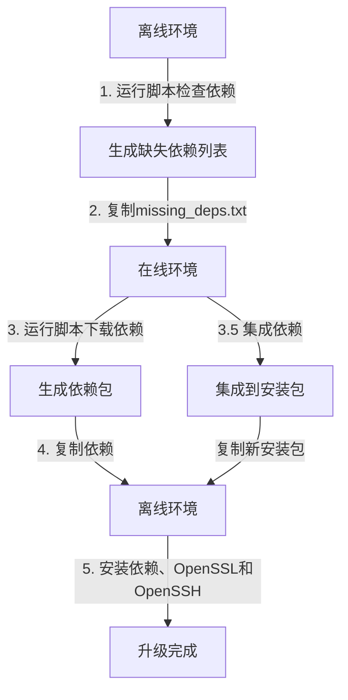

# OpenSSH 9.8p1 和 OpenSSL 1.1.1 离线安装工具 (CentOS 7版)

> **目录说明**：本目录下的 `local_source` 目录用于缓存下载的源码和依赖包。
> 此目录不会被包含在最终的安装包中，您可以：
> - 将其添加到 .gitignore 中
> - 用作临时的下载缓存
> - 在传输安装包前删除此目录
>
> 这个目录的存在不会影响工具的正常使用。

## 项目简介

此工具专为CentOS 7系统设计，用于解决在无网络环境中安装OpenSSH 9.8p1和OpenSSL 1.1.1遇到的依赖问题。它能够：

1. 在离线环境中检查系统缺失的OpenSSH 9.8p1和OpenSSL 1.1.1所需依赖
2. 在有网络环境中下载这些依赖包
3. 将依赖包集成到安装包中，便于离线安装

> **重要说明**：此工具会升级系统的OpenSSL库到1.1.1版本，同时将OpenSSH升级到9.8p1版本。
>
> **主要功能**：
> - 下载并安装OpenSSL 1.1.1w，替换系统原有OpenSSL
> - 使用OpenSSL 1.1.1编译OpenSSH 9.8p1，确保性能和安全性
> - 自动备份原有SSH和SSL配置与二进制文件，确保可以回滚
> - 安装脚本会使用`--with-ssl-dir`选项明确指定使用新的OpenSSL库
> - 升级完成后会自动启动和验证SSH服务和OpenSSL

## 系统要求

- CentOS 7系统
- Root权限
- Bash shell环境
- 用于在线下载依赖时需有互联网连接

## 架构图



## 完整工作流程

### 0. 获取基础包（在线环境）

首先，您需要下载OpenSSH和OpenSSL源码并创建基础安装包：

```bash
sudo ./download_openssh98_centos.sh
```

此步骤会自动下载OpenSSH 9.8p1和OpenSSL 1.1.1源码，并创建基础安装包。

### 1. 依赖检查（离线环境）

```bash
sudo ./check_openssh_deps_centos.sh
# 在菜单中选择选项1：检查系统中缺失的依赖
```

此步骤会检查系统中是否已安装所需的各项依赖，并生成`missing_deps.txt`文件列出所有缺失的依赖。

### 2. 依赖下载（在线环境）

将`missing_deps.txt`文件复制到有网络连接的环境中，然后运行：

```bash
sudo ./check_openssh_deps_centos.sh
# 在菜单中选择选项3：从依赖检查文件下载依赖
```

此步骤会根据`missing_deps.txt`文件下载所有缺失的依赖及其递归依赖，并保存到`downloaded_deps`目录中。

### 3. 集成依赖到安装包（在线环境）

下载完依赖后，将其集成到OpenSSH和OpenSSL安装包中：

```bash
sudo ./check_openssh_deps_centos.sh
# 在菜单中选择选项5：集成缺失依赖到安装包
```

这会生成一个新的安装包`openssh_9.8p1_source_deps_package_updated.tar.gz`，包含所有原始文件和新下载的依赖。

### 4. 安装OpenSSH和OpenSSL（离线环境）

将生成的更新包复制回离线环境：

```bash
# 确保以下三个文件在同一目录下
# - openssh_9.8p1_source_deps_package_updated.tar.gz (集成了依赖的新安装包)
# - install_openssh98_offline_centos.sh (安装脚本)
# - restore_openssh_centos.sh (恢复脚本)

# 赋予脚本执行权限
chmod +x install_openssh98_offline_centos.sh restore_openssh_centos.sh

# 执行安装脚本
sudo ./install_openssh98_offline_centos.sh
```

安装脚本会自动:
- 检测并优先使用更新版本的安装包（如存在）
- 解压安装包
- 安装所有集成的依赖
- 编译并安装OpenSSL 1.1.1到`/usr/local/openssl-1.1.1`
- 使用新安装的OpenSSL编译OpenSSH 9.8p1
- 备份原有配置和程序文件
- 启动并验证SSH服务

### 5. 恢复（如需要）

如果安装过程出现问题，可以使用恢复脚本回滚到原始状态：

```bash
sudo ./restore_openssh_centos.sh
```

## 与Ubuntu/Debian版本的差异

此CentOS 7版工具相对于Ubuntu/Debian版的主要区别：

1. **包管理系统**：使用yum/rpm而非apt/dpkg
2. **依赖包命名**：使用-devel后缀而非-dev（如zlib-devel vs zlib1g-dev）
3. **库位置**：主要库文件位于/usr/lib64而非/usr/lib
4. **服务管理**：SSH服务名为sshd.service而非ssh.service

## `check_openssh_deps_centos.sh` 菜单选项

脚本提供以下功能菜单：

1. **检查系统中缺失的依赖**：扫描系统，检查OpenSSH 9.8p1和OpenSSL 1.1.1所需依赖是否已安装
2. **下载缺失的依赖**：下载上一步检测到的缺失依赖
3. **从依赖检查文件下载依赖**：从指定的文件中读取依赖列表并下载
4. **检查已有依赖包完整性**：验证已下载依赖包的有效性
5. **集成缺失依赖到安装包**：将下载的依赖集成到OpenSSH和OpenSSL安装包中
0. **退出**：退出脚本

## 依赖列表

脚本会检查以下关键依赖：

- **编译工具**：gcc, make, rpm-build, autoconf, automake, libtool
- **OpenSSH开发库**：zlib-devel, pam-devel, libselinux-devel, krb5-devel, audit-libs-devel, openldap-devel, systemd-devel, libedit-devel
- **运行时库**：zlib, pam, libselinux, krb5-libs, audit-libs, openldap, systemd-libs, libedit
- **OpenSSL编译依赖**：perl, perl-core, perl-IPC-Cmd, perl-Pod-Html, pcre-devel

## 关于OpenSSL升级的说明

此工具会将系统的OpenSSL库升级到1.1.1版本，这是因为：

1. OpenSSL 1.1.1提供了更强的安全性和更好的性能
2. 与最新版本的OpenSSH 9.8p1兼容性更好
3. 支持更现代的加密算法和协议

安装OpenSSL 1.1.1的方式：
- 源码会被安装到`/usr/local/openssl-1.1.1`目录
- 创建`/usr/bin/openssl`的符号链接指向新版本
- 添加`/etc/ld.so.conf.d/openssl-1.1.1.conf`确保系统找到新的库文件
- 原始的OpenSSL二进制文件会被备份（使用.bak后缀）

## 日志和调试

- **依赖检查日志**：`deps_check.log`
- **安装日志**：`install.log`
- **恢复日志**：`restore.log`

如遇问题，请查看相应日志文件进行排查。

## 故障排除

1. **无法检测依赖**：
   - 确保在CentOS 7系统上运行，并使用root权限
   - 检查系统版本：`cat /etc/redhat-release`
   - 确保`rpm`和`yum`命令可用
   - 检查`/var/lib/rpm`数据库是否完整

2. **下载依赖失败**：
   - 检查网络连接
   - 确保yum源配置正确：`yum repolist`
   - 尝试清理yum缓存：`yum clean all`
   - 检查磁盘空间：`df -h`
   - 如果使用代理，检查代理配置

3. **集成依赖失败**：
   - 确保OpenSSH安装包格式正确，且包含dependencies目录
   - 检查磁盘空间是否充足
   - 验证依赖包是否完整下载
   - 检查文件系统权限
   - 确保SELinux没有阻止文件访问

4. **OpenSSL编译失败**：
   - 检查是否缺少perl相关依赖
   - 查看`install.log`日志中的具体错误信息
   - 确保gcc和make版本兼容
   - 检查系统内存是否充足
   - 验证源码包完整性

5. **编译OpenSSH失败**：
   - 确保OpenSSL正确安装
   - 检查OpenSSL头文件位置
   - 验证编译工具链完整性
   - 检查系统资源使用情况
   - 查看详细编译日志

6. **SSH服务无法启动**：
   - 使用`journalctl -u sshd`查看详细日志
   - 检查配置文件语法：`sshd -t`
   - 确认端口22没有被占用：`netstat -tuln | grep 22`
   - 检查SELinux状态：`getenforce`
   - 验证权限和密钥文件

7. **OpenSSL升级后的兼容性问题**：
   - 检查依赖OpenSSL的其他服务
   - 验证库文件链接是否正确
   - 检查环境变量设置
   - 测试SSL功能：`openssl version -a`

8. **系统服务依赖问题**：
   - 检查systemd服务状态
   - 验证服务启动顺序
   - 检查服务依赖关系
   - 查看服务日志

## 维护与扩展

### 添加新的依赖检查

1. 在`check_openssh_deps_centos.sh`脚本中编辑`OPENSSH_DEPS`数组：
```bash
OPENSSH_DEPS=(
    "existing-dep1"
    "existing-dep2"
    "new-dep"  # 新添加的依赖
)
```

### 修改OpenSSL配置

1. 在`install_openssh98_offline_centos.sh`中修改OpenSSL编译选项：
```bash
./config \
    --prefix=/usr/local/openssl-1.1.1 \
    --new-option=value \  # 添加新的编译选项
    shared
```

### 修改OpenSSH配置

1. 更新OpenSSH编译选项：
```bash
./configure \
    --with-ssl-dir=/usr/local/openssl-1.1.1 \
    --new-option=value \  # 添加新的编译选项
    --existing-option=value
```

### 添加新的系统支持

1. 在版本检测部分添加新的系统版本支持：
```bash
check_system_version() {
    # 现有的版本检查代码
    # 添加新的版本支持
    if grep -q "CentOS Linux release new_version" /etc/redhat-release; then
        echo "Detected CentOS new_version"
        return 0
    fi
}
```

### 改进错误处理

1. 添加新的错误检查函数：
```bash
check_new_error() {
    # 新的错误检查逻辑
    if [ condition ]; then
        log_error "New error detected"
        return 1
    fi
    return 0
}
```

2. 在主流程中调用新的错误检查：
```bash
main() {
    # 现有的代码
    check_new_error || exit 1
    # 继续执行
}
```

### 添加新功能

1. 创建新的功能函数：
```bash
new_feature() {
    log_info "Starting new feature"
    # 功能实现代码
    log_success "New feature completed"
}
```

2. 在菜单选项中添加新功能：
```bash
show_menu() {
    # 现有的菜单选项
    echo "6) 执行新功能"
}
```

### 测试指南

1. 单元测试：
```bash
test_new_feature() {
    # 测试代码
    assert "expected" "actual"
}
```

2. 集成测试：
```bash
integration_test() {
    # 集成测试代码
}
```

### 文档维护

1. 更新功能列表
2. 添加新的故障排除案例
3. 更新兼容性信息
4. 添加新功能的使用示例
5. 更新架构图

### 版本控制

1. 遵循语义化版本规范
2. 维护更新日志
3. 标记重要的代码修改
4. 记录API更改

### 性能优化

1. 优化依赖检查逻辑
2. 改进下载机制
3. 优化编译配置
4. 改进错误处理效率

### 安全性改进

1. 增加完整性检查
2. 改进权限管理
3. 加强配置验证
4. 更新安全策略

### OpenSSL特定优化

1. 优化SSL配置
2. 更新加密套件
3. 改进性能参数
4. 加强安全设置 