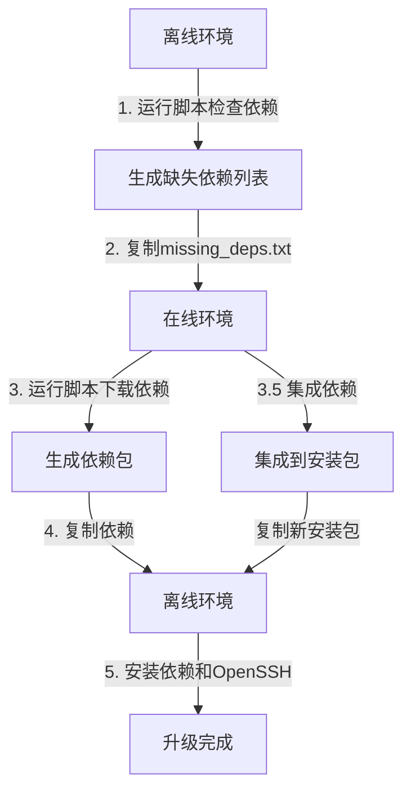

# OpenSSH 9.8p1 离线安装依赖检查与下载工具 (Ubuntu/Debian版)

> **重要提示**：本目录下有两个恢复脚本：
> - `restore_openssh.sh`：**推荐使用**的最新版本恢复脚本
> - `restore_openssh_backup.sh`：旧版恢复脚本，已弃用
>
> 请始终使用 `restore_openssh.sh` 进行恢复操作。

## 项目简介

此工具专为Ubuntu/Debian系统设计，用于解决在无网络环境中安装OpenSSH 9.8p1遇到的依赖问题。它能够：

1. 在离线环境中检查系统缺失的OpenSSH 9.8p1所需依赖
2. 在有网络环境中下载这些依赖包
3. 将依赖包集成到安装包中，便于离线安装

> **重要说明**：此工具**不会**升级系统的SSL库，OpenSSH 9.8p1将使用系统自带的SSL库进行编译和运行。这确保了系统其他组件的兼容性，并减少了潜在的风险。
>
> **已采取的措施**：
> - 已从依赖检查列表中移除所有SSL相关的库（libssl-dev、openssl等）
> - 安装脚本使用`--without-openssl-header-check`选项，防止严格检查OpenSSL头文件
> - 脚本会在编译前检测并显示系统已有的SSL库版本，并明确使用该版本
> - 脚本会自动检测系统SSL头文件位置，并在编译时明确指定使用系统已有的SSL库
> 
> **关于SSH升级**：
> - 此脚本完全支持将OpenSSH升级到9.8p1版本，不会影响升级过程
> - 会自动备份原有SSH配置和二进制文件，确保可以回滚
> - 升级完成后会自动启动和验证SSH服务

## 系统要求

- Ubuntu或Debian系统
- Root权限（sudo）
- Bash shell环境
- 用于在线下载依赖时需有互联网连接

## 架构图



## 完整工作流程

### 1. 依赖检查（离线环境）

```bash
sudo ./check_openssh_deps.sh
# 在菜单中选择选项1：检查系统中缺失的依赖
```

此步骤会检查系统中是否已安装OpenSSH 9.8p1所需的各项依赖，并生成`missing_deps.txt`文件列出所有缺失的依赖。
**注意**：SSL相关库会被自动过滤，确保不会升级系统SSL库。

### 2. 依赖下载（在线环境）

将`missing_deps.txt`文件复制到有网络连接的环境中，然后运行：

```bash
sudo ./check_openssh_deps.sh
# 在菜单中选择选项3：从依赖检查文件下载依赖
```

此步骤会根据`missing_deps.txt`文件下载所有缺失的依赖及其递归依赖，并保存到`downloaded_deps`目录中。
所有SSL相关包会在下载过程中被自动过滤。

### 3. 集成依赖到安装包（在线环境）

下载完依赖后，将其集成到OpenSSH安装包中：

```bash
sudo ./check_openssh_deps.sh
# 在菜单中选择选项5：集成缺失依赖到安装包
```

这会生成一个新的安装包`openssh_9.8p1_source_deps_package_updated.tar.gz`，包含所有原始文件和新下载的依赖。

### 4. 安装OpenSSH（离线环境）

将生成的更新包复制回离线环境：

```bash
# 确保以下三个文件在同一目录下
# - openssh_9.8p1_source_deps_package_updated.tar.gz (集成了依赖的新安装包)
# - install_openssh98_offline.sh (安装脚本)
# - restore_openssh.sh (恢复脚本)

# 赋予脚本执行权限
chmod +x install_openssh98_offline.sh restore_openssh.sh

# 执行安装脚本
sudo ./install_openssh98_offline.sh
```

安装脚本会自动:
- 检测并优先使用更新版本的安装包（如存在）
- 解压安装包
- 安装所有集成的依赖
- 检测系统SSL库并使用现有库编译OpenSSH 9.8p1
- 备份原有配置和程序文件
- 启动并验证SSH服务

### 5. 恢复（如需要）

如果安装过程出现问题，可以使用恢复脚本回滚到原始状态：

```bash
sudo ./restore_openssh.sh
```

## Ubuntu/Debian与CentOS的差异

此Ubuntu/Debian版工具相对于CentOS版的主要区别：

1. **包管理系统**：使用apt/dpkg而非yum/rpm
2. **依赖包命名**：使用-dev后缀而非-devel（如zlib1g-dev vs zlib-devel）
3. **库位置**：主要库文件位于/usr/lib而非/usr/lib64
4. **服务管理**：SSH服务名为ssh.service而非sshd.service

## `check_openssh_deps.sh` 菜单选项

脚本提供以下功能菜单：

1. **检查系统中缺失的依赖**：扫描系统，检查OpenSSH 9.8p1所需依赖是否已安装
2. **下载缺失的依赖**：下载上一步检测到的缺失依赖
3. **从依赖检查文件下载依赖**：从指定的文件中读取依赖列表并下载
4. **检查已有依赖包完整性**：验证已下载依赖包的有效性
5. **集成缺失依赖到安装包**：将下载的依赖集成到OpenSSH安装包中
0. **退出**：退出脚本

## 依赖列表

脚本会检查以下关键依赖（已排除SSL相关库）：

- **编译工具**：gcc, make, dpkg-dev, autoconf, automake, libtool
- **开发库**：zlib1g-dev, libpam0g-dev, libselinux1-dev, libkrb5-dev, libaudit-dev, libldap2-dev, libsystemd-dev, libedit-dev
- **运行时库**：zlib1g, libpam0g, libselinux1, libkrb5-3, libaudit1, libldap-2.4-2, libsystemd0, libedit2

## 关于SSL库的特别说明

本工具特别设计为**不升级系统SSL库**，这是因为：

1. 升级SSL库可能会影响系统中依赖该库的其他组件
2. 在生产环境中，SSL库升级需要更严格的测试和验证
3. OpenSSH 9.8p1完全可以使用系统已有的SSL库编译运行

安装脚本会自动检测系统SSL库并使用该库编译OpenSSH，不会尝试更新或替换系统SSL组件。

## 日志和调试

- **依赖检查日志**：`deps_check.log`
- **安装日志**：`install.log`
- **恢复日志**：`restore.log`

如遇问题，请查看相应日志文件进行排查。

## 故障排除

1. **无法检测依赖**：
   - 确保在Ubuntu/Debian系统上运行，并使用root权限
   - 检查系统版本是否在支持列表中
   - 确保`dpkg`和`apt`命令可用
   - 检查`/var/lib/dpkg/status`文件权限是否正确

2. **下载依赖失败**：
   - 检查网络连接
   - 确保apt源配置正确
   - 尝试更新apt缓存：`apt-get update`
   - 检查磁盘空间是否充足
   - 如果使用代理，确保代理配置正确

3. **集成依赖失败**：
   - 确保OpenSSH安装包格式正确，且包含dependencies目录
   - 检查磁盘空间是否充足
   - 验证依赖包是否完整下载
   - 检查文件系统权限

4. **编译失败**：
   - 检查是否缺少必要的库文件
   - 查看`install.log`日志中的具体错误信息
   - 确保gcc和make版本兼容
   - 检查系统内存是否充足
   - 验证源码包完整性

5. **SSH服务无法启动**：
   - 使用`journalctl -u ssh`查看详细日志
   - 检查配置文件语法：`sshd -t`
   - 确认端口22没有被占用：`netstat -tuln | grep 22`
   - 检查SELinux状态和配置
   - 验证权限和密钥文件

6. **升级后无法连接**：
   - 检查防火墙规则
   - 验证sshd_config配置
   - 确认认证方式（密码/密钥）配置正确
   - 检查客户端版本兼容性
   - 使用`ssh -v`获取详细连接日志

7. **依赖冲突**：
   - 检查系统中可能存在的冲突包
   - 尝试先卸载冲突包
   - 查看`/var/log/apt/history.log`了解包安装历史
   - 使用`apt-cache policy`检查包版本

## 维护与扩展

### 添加新的依赖检查

1. 在`check_openssh_deps.sh`脚本中编辑`OPENSSH_DEPS`数组：
```bash
OPENSSH_DEPS=(
    "existing-dep1"
    "existing-dep2"
    "new-dep"  # 新添加的依赖
)
```

2. 如果新依赖是SSL相关的，需要在`SSL_PACKAGES`数组中添加：
```bash
SSL_PACKAGES=(
    "existing-ssl-pkg1"
    "new-ssl-pkg"  # 新添加的SSL相关包
)
```

### 修改编译配置

1. 在`install_openssh98_offline.sh`中的`configure`命令部分修改编译选项：
```bash
./configure \
    --prefix=/usr \
    --new-option=value \  # 添加新的编译选项
    --existing-option=value
```

### 添加新的系统支持

1. 在版本检测部分添加新的系统版本支持：
```bash
check_system_version() {
    # 现有的版本检查代码
    # 添加新的版本支持
    if [[ "$VERSION_ID" == "new_version" ]]; then
        echo "Detected Ubuntu/Debian new_version"
        return 0
    fi
}
```

### 改进错误处理

1. 添加新的错误检查函数：
```bash
check_new_error() {
    # 新的错误检查逻辑
    if [ condition ]; then
        log_error "New error detected"
        return 1
    fi
    return 0
}
```

2. 在主流程中调用新的错误检查：
```bash
main() {
    # 现有的代码
    check_new_error || exit 1
    # 继续执行
}
```

### 添加新功能

1. 创建新的功能函数：
```bash
new_feature() {
    log_info "Starting new feature"
    # 功能实现代码
    log_success "New feature completed"
}
```

2. 在菜单选项中添加新功能：
```bash
show_menu() {
    # 现有的菜单选项
    echo "6) 执行新功能"
}
```

### 测试指南

1. 单元测试：
```bash
test_new_feature() {
    # 测试代码
    assert "expected" "actual"
}
```

2. 集成测试：
```bash
integration_test() {
    # 集成测试代码
}
```

### 文档维护

1. 更新功能列表
2. 添加新的故障排除案例
3. 更新兼容性信息
4. 添加新功能的使用示例
5. 更新架构图

### 版本控制

1. 遵循语义化版本规范
2. 维护更新日志
3. 标记重要的代码修改
4. 记录API更改

### 性能优化

1. 优化依赖检查逻辑
2. 改进下载机制
3. 优化编译配置
4. 改进错误处理效率

### 安全性改进

1. 增加完整性检查
2. 改进权限管理
3. 加强配置验证
4. 更新安全策略 